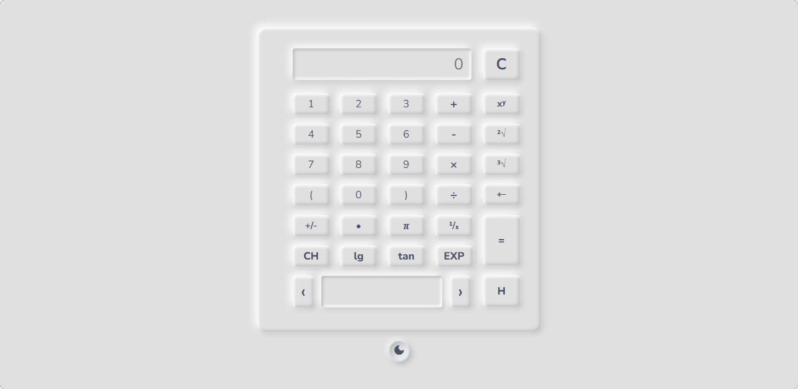
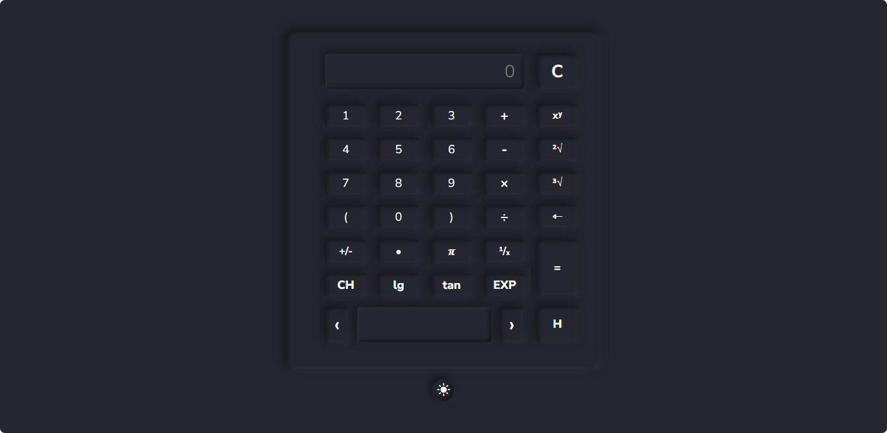

# Calculator

Scientific calculator powered by JavaScript. The calculator includes number buttons, a clear button, 5 operator buttons such as "Addition, Subtraction, Multiplication, Division and Exponentiation", a backspace button, a dot button and a display to show the operations. I have used `input` tags to get the values into the display.

[CALCULATOR_LINK](https://aaturbordia.github.io/Calculator/Cal.html)

### Screenshots

In addition, this calculator also has 5 other scientific operations. This calculator has Clear, Backspace, History, Percentage and π buttons. You can find a number's square root and cube root using this calculator. I am just working on this, I'll upload a youtube video soon.

